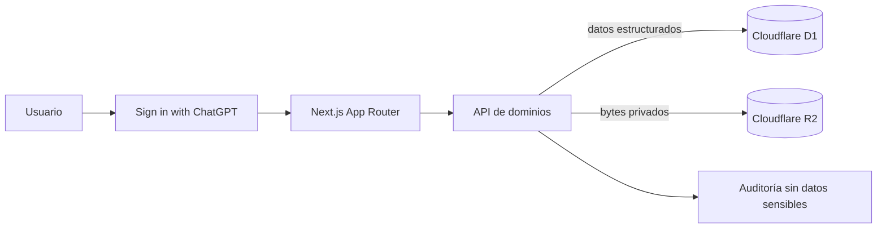
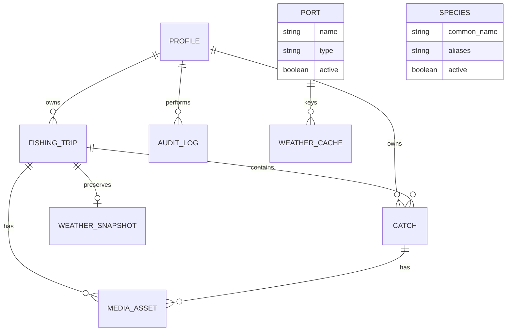

# Arquitectura y operación de YucaFish

## Dominios

`app/api/yucafish` concentra operaciones tipadas de perfiles, pescas, capturas, catálogos, estadísticas derivadas y auditoría. `app/api/media` valida contenido real JPG/PNG/WebP, limita a 8 MB, genera claves no predecibles y verifica propiedad antes de leer, subir o borrar. La UI está separada en landing pública, aplicación privada y páginas legales.

## Flujo de datos

## Entidades

Las estadísticas y logros se calculan desde registros autorizados para evitar contadores inconsistentes. Las bajas de pescas y capturas son lógicas. Los archivos se retiran físicamente mediante la operación de borrado de medios.

## Rutas

- Públicas: `/`, `/iniciar-sesion`, `/registro`, `/verificar-correo`, `/olvide-mi-contrasena`, `/restablecer-contrasena`, `/cerrar-sesion`, `/privacidad` y `/terminos`.
- Proveedor: `/signin-with-chatgpt` y `/signout-with-chatgpt` son administradas por Sites únicamente en producción; las pantallas públicas usan la cuenta demo cuando detectan localhost.
- Aplicación: `/app` y cualquier subruta bajo `/app/*`.
- APIs: `/api/yucafish`, `/api/media`, `/api/health`.
- Clima: `/api/weather/locations`, `/api/weather/locations/:id`, sus vistas `hourly` y `daily`, y `/api/fishing-trips/:id/weather-snapshot`.
- Administración: integrada en `/app` y disponible solo cuando el perfil servidor tiene rol `ADMIN`.

## Seguridad

- Identidad tomada exclusivamente del encabezado firmado de la plataforma; la excepción demo solo funciona en localhost.
- Consultas por objeto siempre combinan `id` y correo de sesión para impedir IDOR.
- Fotografías privadas, MIME verificado por firma, límite de 8 MB y nombres aleatorios.
- CSP, HSTS, protección de framing, `nosniff`, política de permisos y referrer policy.
- Auditoría con hash parcial irreversible del actor; nunca contraseñas, tokens o binarios.
- SQL preparado y validación duplicada en servidor. Errores seguros sin stack trace al usuario.
- Open-Meteo se consulta únicamente desde el servidor, con hosts permitidos, timeout, límite de respuesta, Zod, un reintento controlado, rate limiting persistente y caché D1 con tolerancia a datos obsoletos.

## Correo y autenticación

La identidad y verificación de correo son responsabilidad del flujo administrado por la plataforma. Por eso YucaFish no implementa criptografía, restablecimiento de contraseña ni plantillas que simulen correos. Si en una segunda implementación pública se migra a Supabase Auth, se deben configurar plantillas reales de verificación, recuperación, cambio de contraseña y bienvenida mediante el proveedor, junto con rate limiting distribuido.

## Catálogos y datos iniciales

La primera inicialización crea especies regionales sugeridas y puertos de Yucatán en D1. `Jurel` contiene los alias `curél,curel`. Estos nombres son orientativos y administrables; la interfaz no los presenta como catálogo exhaustivo.

## Migraciones, respaldo y restauración

Los cambios de esquema se hacen en `db/schema.ts`, después `npm run db:generate`, inspección del SQL y despliegue controlado. Nunca ejecutar migraciones destructivas automáticamente. Para respaldos, exporta D1 antes de migrar y conserva una política de versiones del bucket R2. Para restaurar, crea una base nueva, aplica migraciones en orden, importa el respaldo validado y cambia el binding solo después de una verificación de conteos y propiedad.

## Decisiones y contradicciones resueltas

- El prompt prefería PostgreSQL/Supabase o Auth.js; Sites proporciona D1, R2 e identidad administrada, que cubren persistencia, archivos y autenticación sin almacenar contraseñas.
- La sincronización offline compleja se deja fuera para no arriesgar integridad. La PWA es instalable y muestra la última interfaz cargada, pero no encola escrituras.
- Compartir y descargar aparecen como arquitectura futura, no como botones inertes.
- Las pescas conservan texto aproximado y una referencia al catálogo de puertos; no se captura GPS del usuario. Las coordenadas meteorológicas pertenecen al catálogo administrado y nunca se aceptan desde el cliente.

## Operación y despliegue

1. Ejecutar lint, TypeScript, pruebas y build.
2. Revisar la migración Drizzle y respaldar antes de cambios.
3. Desplegar con Sites, que provisiona D1/R2 desde `.openai/hosting.json`.
4. Verificar `/api/health`, acceso privado, CRUD, carga de imagen y panel administrativo.
5. Revisar logs sin exponer secretos; rotar cualquier credencial externa desde la plataforma.

## Fase 2

Amigos, salidas compartidas, perfil público opcional, PDF/CSV, clima/mareas históricas, equipos, mapas privados, moderación, IA de especies, colaboración, modo offline con resolución de conflictos y aplicaciones nativas. Ninguna está simulada en la primera versión.
