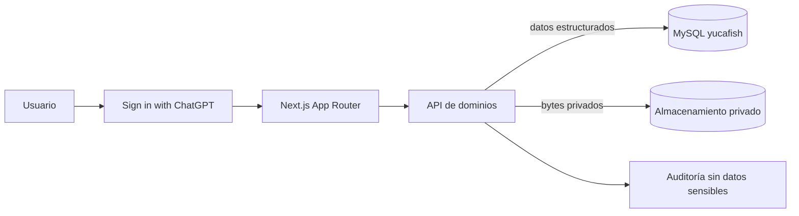
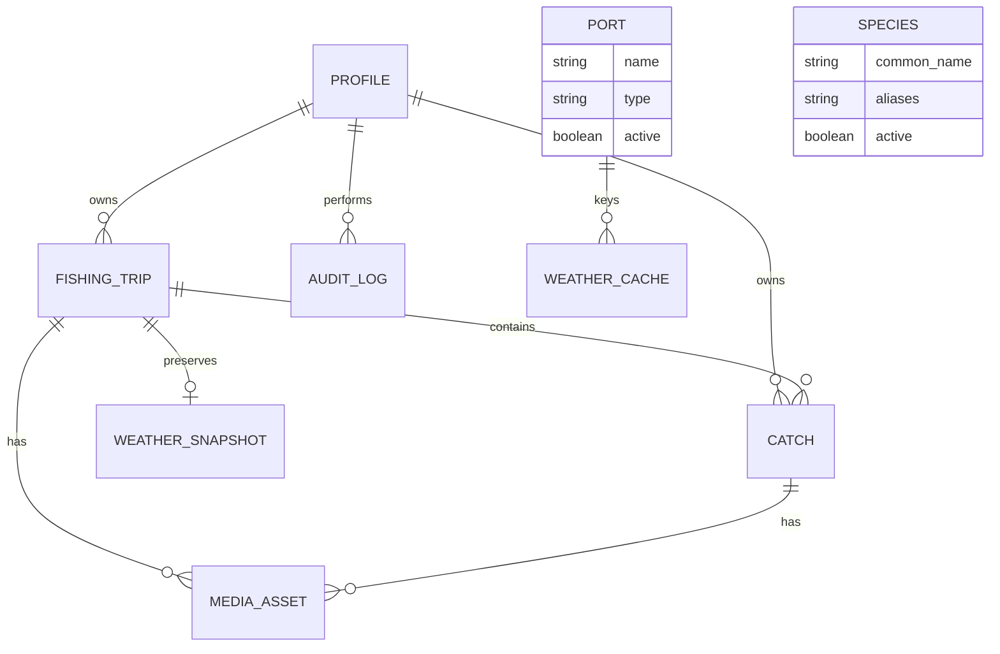

# Arquitectura y operación de GoFishing.mx

## Dominios

`app/api/yucafish` concentra operaciones tipadas de perfiles, pescas, capturas, catálogos, estadísticas derivadas y auditoría. `app/api/media` valida contenido real JPG/PNG/WebP, limita a 8 MB, genera claves no predecibles y verifica propiedad antes de leer, subir o borrar. La UI está separada en landing pública, aplicación privada y páginas legales.

## Flujo de datos

```mermaid
flowchart LR
  U[Usuario] --> A[Sign in with ChatGPT]
  A --> UI[Next.js App Router]
  UI --> API[API de dominios]
  API -->|datos estructurados| MYSQL[(MySQL yucafish)]
  API -->|bytes privados| STORAGE[(Almacenamiento privado)]
  API --> AUD[Auditoría sin datos sensibles]
```

## Entidades

```mermaid
erDiagram
  PROFILE ||--o{ FISHING_TRIP : owns
  PROFILE ||--o{ CATCH : owns
  FISHING_TRIP ||--o{ CATCH : contains
  FISHING_TRIP ||--o{ MEDIA_ASSET : has
  CATCH ||--o{ MEDIA_ASSET : has
  PROFILE ||--o{ AUDIT_LOG : performs
  FISHING_TRIP ||--o| WEATHER_SNAPSHOT : preserves
  PORT ||--o{ WEATHER_CACHE : keys
  SPECIES { string common_name string aliases boolean active }
  PORT { string name string type boolean active }
```

Las estadísticas y logros se calculan desde registros autorizados para evitar contadores inconsistentes. Las bajas de pescas y capturas son lógicas. Los archivos se retiran físicamente mediante la operación de borrado de medios.

## Rutas

- Públicas: `/`, `/iniciar-sesion`, `/registro`, `/verificar-correo`, `/olvide-mi-contrasena`, `/restablecer-contrasena`, `/cerrar-sesion`, `/privacidad` y `/terminos`.
- Proveedor: `/signin-with-chatgpt` y `/signout-with-chatgpt` son administradas por Sites únicamente en producción; las pantallas públicas usan la cuenta demo cuando detectan localhost.
- Aplicación: `/app` y cualquier subruta bajo `/app/*`.
- APIs: `/api/yucafish`, `/api/media`, `/api/health`.
- Clima: `/api/weather/locations`, `/api/weather/locations/:id`, sus vistas `hourly` y `daily`, y `/api/fishing-trips/:id/weather-snapshot`.
- Administración: integrada en `/app` y disponible solo cuando el perfil servidor tiene rol `ADMIN`.

## Seguridad

- Identidad tomada exclusivamente del encabezado firmado de la plataforma; la excepción demo solo funciona en localhost.
- Consultas por objeto siempre combinan `id` y correo de sesión para impedir IDOR.
- Fotografías privadas, MIME verificado por firma, límite de 8 MB y nombres aleatorios.
- CSP, HSTS, protección de framing, `nosniff`, política de permisos y referrer policy.
- Auditoría con hash parcial irreversible del actor; nunca contraseñas, tokens o binarios.
- SQL preparado y validación duplicada en servidor. Errores seguros sin stack trace al usuario.
- Open-Meteo se consulta únicamente desde el servidor, con hosts permitidos, timeout, límite de respuesta, Zod, un reintento controlado, rate limiting persistente y caché MySQL con tolerancia a datos obsoletos.

## Correo y autenticación

La autenticación, verificación de correo, recuperación y restablecimiento se resuelven dentro de la aplicación y sus integraciones SMTP. Cualquier ajuste de identidad debe mantenerse compatible con MySQL y sin exponer secretos.

## Catálogos y datos iniciales

La base `yucafish` conserva especies regionales sugeridas y puertos de Yucatán. `Jurel` contiene los alias `curél,curel`. Estos nombres son orientativos y administrables; la interfaz no los presenta como catálogo exhaustivo.

## Migraciones, respaldo y restauración

Los cambios de esquema se hacen en `db/schema.ts`, después `npm run db:generate`, inspección manual del SQL y despliegue controlado. Nunca ejecutar migraciones destructivas automáticamente. Antes de migrar, respaldar MySQL `yucafish`; para restaurar, crear una base nueva, aplicar migraciones en orden, importar el respaldo validado y cambiar la conexión solo después de verificar conteos y propiedad.

## Decisiones y contradicciones resueltas

- Este proyecto quedó estandarizado en MySQL para desarrollo y producción. SQLite, D1 y cualquier fallback local están prohibidos.
- La sincronización offline compleja se deja fuera para no arriesgar integridad. La PWA es instalable y muestra la última interfaz cargada, pero no encola escrituras.
- Compartir y descargar aparecen como arquitectura futura, no como botones inertes.
- Las pescas conservan texto aproximado y una referencia al catálogo de puertos; no se captura GPS del usuario. Las coordenadas meteorológicas pertenecen al catálogo administrado y nunca se aceptan desde el cliente.

## Operación y despliegue

1. Ejecutar lint, TypeScript, pruebas y build.
2. Revisar la migración Drizzle y respaldar antes de cambios.
3. Desplegar en el VPS Node.js con `DATABASE_URL` apuntando a MySQL `yucafish`.
4. Verificar `/api/health`, acceso privado, CRUD, carga de imagen y panel administrativo.
5. Revisar logs sin exponer secretos; rotar cualquier credencial externa desde la plataforma.

## Fase 2

Amigos, salidas compartidas, perfil público opcional, PDF/CSV, clima/mareas históricas, equipos, mapas privados, moderación, IA de especies, colaboración, modo offline con resolución de conflictos y aplicaciones nativas. Ninguna está simulada en la primera versión.
